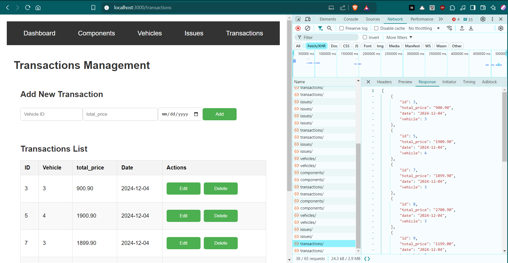

# Delivery Management System

A full-stack web application for managing vehicle service systems. This project allows users to register components, manage vehicles, log issues, and handle transactions. It also includes a dashboard for visualizing revenue data using interactive graphs.

## Features
1. **Component Management**: Add and view vehicle components with their repair pricing or new purchase costs.
2. **Vehicle Management**: Add and manage vehicles in the system.
3. **Issue Management**: Log issues for vehicles and select between new component purchases or repairs.
4. **Transaction Management**: Calculate final prices for issues and record transactions.
5. **Revenue Dashboard**: View daily, monthly, and yearly revenue using Recharts for visual representation.
6. **Responsive Design**: User-friendly interface built with React.

## Screenshots

### Dashboard


### Component Management


### Vehicle Management


### Issue Management


### Transaction Management


---

## Tech Stack
- **Backend**: Django, Django REST Framework
- **Frontend**: React.js with Recharts for graphs
- **Database**: SQLite (default Django database)
- **API Integration**: Axios for frontend-backend communication

---

## Prerequisites

Ensure you have the following installed on your system:
1. Python (>= 3.8)
2. Node.js and npm (>= 16.x)
3. Git
4. pip install django
5. pip install django-cors-headers
6. pip install djangorestframework
7. npm install recharts
8. npm install axios

---

## Installation Instructions

### 1. Clone the Repository
```bash
git clone https://github.com/your-username/delivery-management-system.git
cd delivery-management-system
